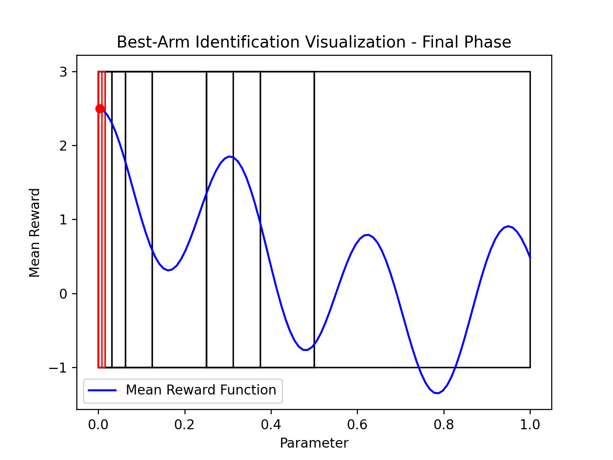
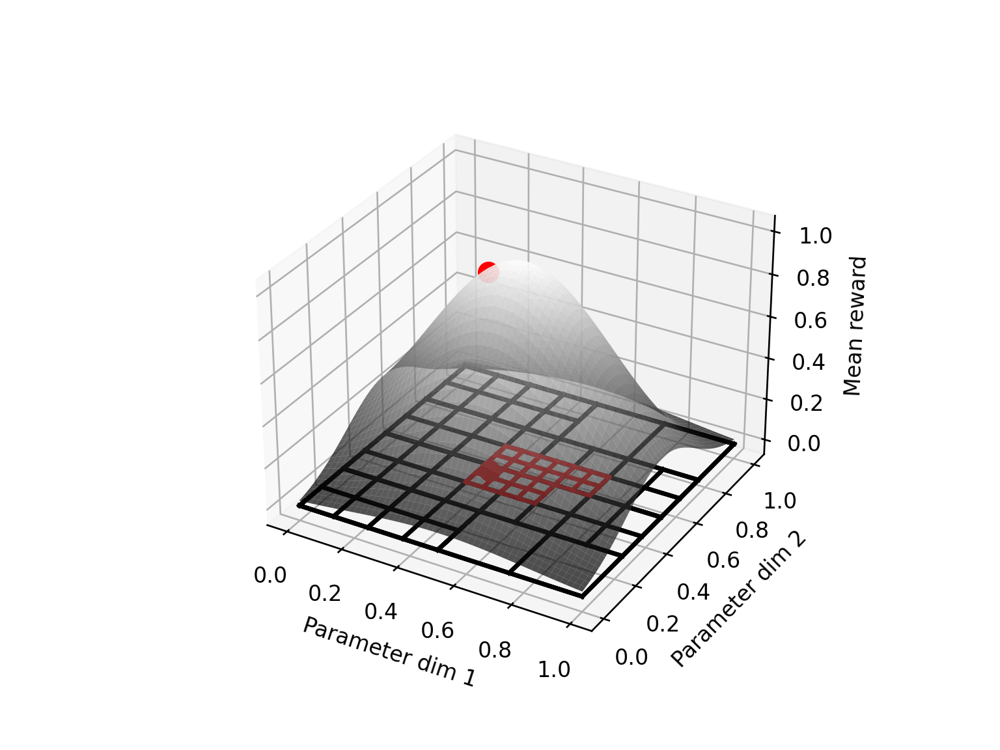

<!-- Improved compatibility of back to top link: See: https://github.com/othneildrew/Best-README-Template/pull/73 -->

<!--
*** Thanks for checking out the Best-README-Template. If you have a suggestion
*** that would make this better, please fork the repo and create a pull request
*** or simply open an issue with the tag "enhancement".
*** Don't forget to give the project a star!
*** Thanks again! Now go create something AMAZING! :D
-->

# Best-Arm Identification in Continuous Spaces with Lipschitz Rewards

This repository focuses on a **best-arm identification (BAI)** algorithm in the context of **multi-armed bandits (MABs)** with **Lipschitz-continuous reward functions** defined over a continuous action space.

Multi-armed bandit problems are a class of sequential decision-making problems where an agent balances exploration and exploitation to maximize cumulative reward or identify the best action (arm). In continuous spaces, the challenge becomes more intricate as the number of possible arms is uncountable, and the reward function's smoothness must be leveraged for efficient decision-making.

### Key Concepts

1. **Multi-Armed Bandits (MABs)**:
   - MABs involve selecting an action (arm) from a set of possible actions and observing a stochastic reward.
   - The agent seeks to identify the arm with the highest expected reward or maximize cumulative rewards over time.

2. **Best-Arm Identification (BAI)**:
   - The objective is to identify the arm that maximizes the expected reward within a fixed budget of interactions or with a predefined confidence level.
   - BAI is critical in settings where deploying the best solution has high stakes (e.g., drug testing, hyperparameter optimization).

3. **Lipschitz Continuity**:
   - Reward functions are assumed to be Lipschitz continuous, meaning the difference in rewards between two arms is bounded by a constant times the distance between them.
   - This smoothness assumption allows the agent to generalize information from explored regions to unexplored ones.

### References

To understand the foundations and advancements in multi-armed bandits, best-arm identification, and Lipschitz reward models, the following resources are highly recommended:

1. **Multi-Armed Bandit Tutorials**:
   - Bubeck, S., & Cesa-Bianchi, N. (2012). *"Regret Analysis of Stochastic and Nonstochastic Multi-Armed Bandit Problems."* Foundations and Trends in Machine Learning. 
   - Lattimore, T., & Szepesvári, C. (2020). *"Bandit Algorithms."* 

2. **Lipschitz Bandits and Continuous Spaces**:
   - Kleinberg, R., Slivkins, A., & Upfal, E. (2008). *"Multi-armed bandits in metric spaces."*
   - Feng, Y., Luo, W., Huang, Y., & Wang, T. (2020). “A Lipschitz Bandits Approach for Continuous Hyperparameter Optimization.” 
3. **Best-Arm Identification**:
   - Kaufmann, E., Cappé, O., & Garivier, A. (2016). *"On the Complexity of Best-Arm Identification in Multi-Armed Bandit Models."* Journal of Machine Learning Research.
   - Bubeck, S., Munos, R., Stoltz, G., & Szepesvári, C. (2011). *"X-armed Bandits."* Journal of Machine Learning Research.

---

We assume that arms are embedded in the unit cube $[0, 1]^d$. The algorithm adaptively discretizes the parameter spaces implemented in !()[cube_discretizer.py], and uses the Lipschitz condition to adaptively refine the grid. The algorithm has a parameter $\beta$ that controls the number of pulls per arm in each discretization phase and a parameter $\delta$ that can be use a a bound on the noise if the rewards come from a shifted distribution. It also requires an estimate of the Lipschitz constant $L$ of the ground-truth distribution. In the paper ??? we prove that this algorithm has simple regret bounded by

$$R(n) \leq $$
where $n$ is the total number of pulls.

<!-- USAGE EXAMPLES -->
## Usage

The file [analysis.ipynb](analysis.ipynb) runs the algorithm for an example 1D and 2D parameter spaces.
The examples consider Guassian bandits with mean rewards given by
$\mathcal{N}(cos(4x)-cos(x)/2 +cos(20x)+1, \sigma)$
and
$\mathcal{N}(exp(-(x-0.5)^2 * 5) * exp(-(y-0.5)^2 * 10), \sigma)$
where $x(,y)\in\mathbb{R}^d$ is the arm index.
The figures show the mean reward functions, the adaptively-discretized grid with the eliminated cubes in black and the active cubes in red. The red dots indicate the estimated best-arm.
  

